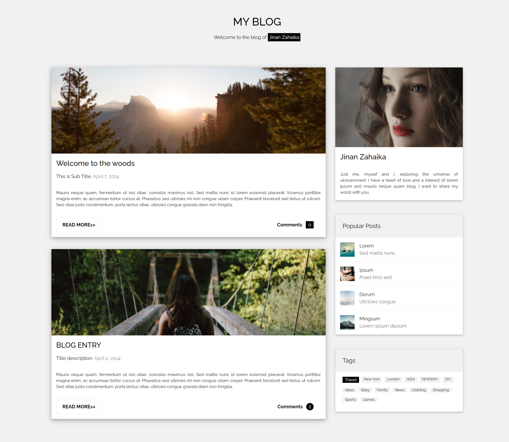

# Blog-Page

**I have created a responsive Blog webpage using React + Vite**.This is my own solution to the [My Blog template on w3schools](https://www.w3schools.com/w3css/tryw3css_templates_blog.htm).

# Live Demo

- https://jinan-ishaq.github.io/my-blog/

# Technologies Used

- React
- Vite
- JavaScript (ES6+)
- Tailwind CSS

# Installation

    1. Clone the repo: git clone https://github.com/jinan-ishaq/my-blog.git
    2. Navigate to the project folder: cd myBlog
    3. Install the dependencies: npm install
    4. Start the development server: npm run dev
    5. Open your browser and go to: http://localhost:5173/
